PDF Knowledge Base Q&A System (Gemini + FAISS + Streamlit):

An AI-powered document question-answering system. Upload a PDF, ask questions, get context-aware answers backed by semantic search and Google Gemini.


Key Features:

Upload and process PDF documents
Smart text chunking with overlap
Semantic search using FAISS
Local embeddings with Sentence Transformers
Answer generation using Google Gemini
Confidence scoring for responses
Interactive UI built with Streamlit
Debug view for retrieved context


Tech Stack:

| Layer        | Technology                                          | Reasoning                                 |
| ------------ | --------------------------------------------------- | ----------------------------------------- |
| UI           | Streamlit                                           | Rapid prototyping for interactive AI apps |
| LLM          | Google Gemini (`2.5-flash`)                         | Fast, cost-efficient generation           |
| RAG Pipeline | Custom implementation                               | Full control over retrieval logic         |
| Embeddings   | Sentence Transformers (`all-MiniLM-L6-v2`)          | Lightweight, low latency                  |
| Vector Store | FAISS (`IndexFlatL2`)                               | Exact search, no external dependency      |
| PDF Parsing  | PyPDF2                                              | Simple text extraction                    |
| Numerical    | NumPy                                               | Efficient vector operations               |
| API Client   | google-genai                                        | Gemini integration                        |
| State Mgmt   | Streamlit session state                             | Maintain UI state                         |
| Language     | Python                                              | Ecosystem support                         |


Project Structure:


```bash
PDF-Knowledge-base-Q-A-System/
├── app.py                    # Main Streamlit app
├── config.py                 # Configuration settings
├── requirements.txt          # Dependencies
├── README.md
├── models/
│   ├── __init__.py
│   ├── document_processor.py  # PDF extraction & chunking
│   ├── knowledge_retriever.py # Embedding + FAISS
│   └── qa_engine.py           # Gemini-based QA
└── utils/
    ├── __init__.py
    └── helpers.py             # UI helpers

```

System Architecture:

flowchart TD




Chunking Strategy:

Text is split using a token-aware, sentence-level chunker built on tiktoken.
Why token-aware: The embedding model all-MiniLM-L6-v2 has a hard limit of 512 tokens. A character-based chunker (e.g. 1000 chars) silently produces chunks that exceed this limit the model truncates them without any error, degrading retrieval quality invisibly on longer documents.

How it works:

Full document text is split into sentences using regex boundary detection.
Sentences are accumulated into a chunk until the next sentence would push the token count past 400 (conservative limit below the 512-token cap).
When a chunk is full, the last 2 sentences are carried into the next chunk as overlap preserving cross-boundary context.
Any single sentence exceeding 400 tokens is hard-truncated at the token boundary.


**Parameters (configurable in `document_processor.py`):**

| Parameter | Default | Description |
|---|---|---|
| `max_tokens` | 400 | Max tokens per chunk |
| `overlap_sentences` | 2 | Sentences carried into next chunk |


Retrieval Method:

Retrieval uses FAISS IndexFlatL2 — exact brute-force nearest-neighbour search over L2 (Euclidean) distance.
Flow:

Query is embedded using the same all-MiniLM-L6-v2 model used at index time.
FAISS searches all chunk embeddings and returns the top-k closest vectors.
L2 distance is converted to a similarity score: similarity = 1 / (1 + distance).
Chunks below the similarity threshold (0.3) are filtered out.
Remaining results are sorted by similarity descending.
Top 3 chunks are passed as context to Gemini.

Fallback: If no chunks meet the threshold, the retriever retries with k=1 and no threshold filter, ensuring the model always receives some context rather than returning a blank answer.


Confidence Scoring:

The system calculates confidence based on similarity scores:

| Score   | Meaning         |
| ------- | --------------- |
| > 0.5   | High confidence |
| 0.3–0.5 | Medium          |
| < 0.3   | Low             |


Guardrails
Prompt-level:

Gemini is instructed to answer only from the provided context.
If the context doesn't contain relevant information, it must say so explicitly rather than hallucinating.

Retrieval-level:

Similarity threshold of 0.3 prevents low-quality chunks from reaching the model.
Only the top 3 chunks are sent, keeping context focused.

Application-level:

Per-session temp directories prevent file collisions between concurrent users.
Config never raises at import time, missing API key shows a user-friendly error instead of a crash.
All errors are logged server-side via Python logging for observability.

## Known Failure Cases

| Scenario | Behaviour |
|---|---|
| Scanned PDF (image-based) | PyPDF2 extracts no text; app shows "No text could be extracted" |
| Very long sentences (> 400 tokens) | Hard-truncated at the token boundary; tail content is lost |
| Queries about content not in the PDF | Gemini returns "I cannot find information about [topic]" |
| Highly technical or domain-specific language | Embedding model may not capture semantic similarity well; retrieval degrades |
| Multi-PDF questions | Not supported; only one PDF per session |
| Non-English PDFs | Works for most Latin-script languages; quality degrades for CJK and RTL scripts |

---

1. Clone Repository
git clone https://github.com/Aaditya902/PDF-Knowledge-base-Q-A-System.git 
cd PDF-Knowledge-base-Q-A-System

2. Create Virtual Environment
python -m venv myenv
source myenv/bin/activate      # Mac/Linux
myenv\Scripts\activate         # Windows

3. Install Dependencies
pip install -r requirements.txt

4. Configure Environment Variables

Create a .env file in root:

GOOGLE_API_KEY=your_google_api_key


Run the Application:
streamlit run app.py

Open in browser:

http://localhost:8501


How It Works:
1. Document Processing

Extracts text using PyPDF2
Adds page references

2. Chunking

Splits text into chunks (MAX_CHUNK_SIZE = 1000)
Adds overlapping context for better retrieval

3. Embedding

Uses all-MiniLM-L6-v2
Converts text into dense vectors

4. Retrieval

Stores embeddings in FAISS index
Performs similarity search

5. Answer Generation

Retrieves top-k relevant chunks
Sends context + query to Gemini
Generates response


